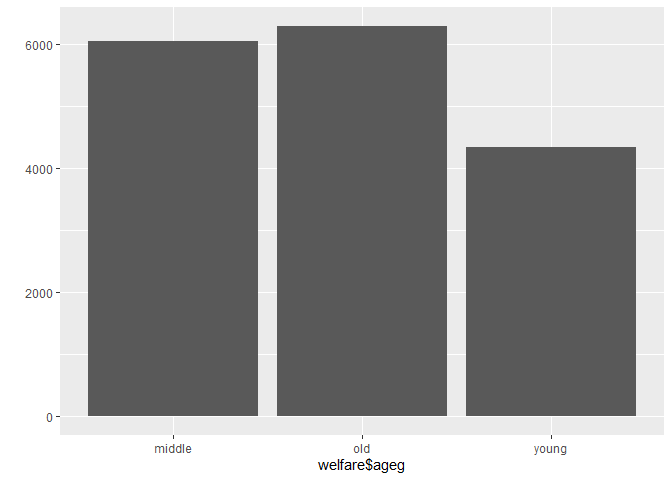

연령대에 따른 월급 차이
================
오유리
July 30, 2020

## 4\. 연령대에 따른 월급 차이

### 분석 절차

### 연령대 변수 검토 및 전처리하기

#### 1\. 파생변수 만들기 - 연령대

연령대와 월급 변수를 가지고 연령대별 월급 평균표와 그래프를 만든다. 나이 변수를 연령대 변수로 만든다. 각 범주에 몇 명이
있는지 본다.

``` r
welfare<- welfare %>% 
  mutate(ageg = ifelse(age<30, "young", ifelse(age <= 59, "middle","old")))

table(welfare$ageg)
```

    ## 
    ## middle    old  young 
    ##   6049   6281   4334

``` r
qplot(welfare$ageg)
```

<!-- -->

### 연령대에 따른 월급 차이 분석하기

#### 1\. 연령대별 월급 평균표 만들기

월급 변수 전처리는 이미 완료 했으니 생략한다. 분석 결과를 보면 월급 평균이 초년 163만 원, 중년 281만 원, 노년
125만 원이다.

``` r
ageg_income <- welfare %>% 
  filter(!is.na(income)) %>% 
  group_by(ageg) %>% 
  summarise(mean_income = mean(income))

ageg_income
```

    ## # A tibble: 3 x 2
    ##   ageg   mean_income
    ##   <chr>        <dbl>
    ## 1 middle        281.
    ## 2 old           125.
    ## 3 young         164.

#### 2\. 그래프 만들기

``` r
ggplot(data = ageg_income, aes(x = ageg, y = mean_income)) + geom_col()
```

<!-- --> \#\#\#\#
막대 정렬 : 초년, 중년, 노년 나이 순

ggplot은 막대를 변수의 알파벳 순으로 정렬하도록 기본값이 설정되어 있다. 막대가 초년, 중년, 노년의 나이 순으로 정렬되도록
설정한다.

결과를 보면 중년이 가장 많이 받는걸 알 수 있다.

``` r
ggplot(data = ageg_income, aes(x = ageg,y = mean_income)) + geom_col() + scale_x_discrete(limits = c("young", "middle","old"))
```

<!-- -->
