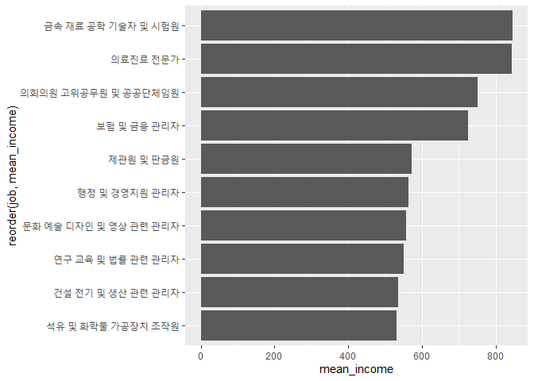
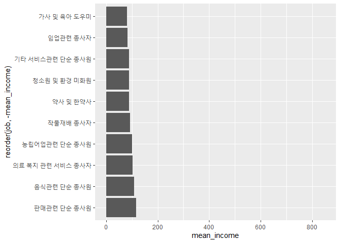

직업별 월급 차이
================
오유리
July 30, 2020

## 6\. 직업별 월급 차이

### 분석 절차

검토 및 전처리할 변수: 직업, 월급 직업별 월급 평균표와 그래프를 만든다.

### 직업 변수 검토 및 전처리하기

#### 1\. 변수 검토하기

직업변수 code\_job을 살펴본다. 직업데이터는 직업분류코드로 입력되어 있다.-\> 직업 명칭 변수를 만들어야 한다.

``` r
class(welfare$code_job)

table(welfare$code_job)
```

#### 2\. 전처리

직업분류코드 목록을 이용해 직업의 명칭으로 된 변수를 만든다. Koweps\_Codebook.xlsx를 다운로드해 프로젝트 폴더에
삽입한 후 불러온다. “직종 코드” 시트에 코드가 정리되어 있다. 첫행을 변수명, 엑셀 파일의 두 번째 시트에 있는 직업 분류
코드 목록을 불러오도록 sheet 파라미터에 2를 지정한다.

출력결과, 코드와 직업명 두 변수로 구성돼있고 직업이 149개로 분류된다는 것을 알 수 있다.

``` r
library(readxl)
list_job <- read_excel("Koweps_Codebook.xlsx", col_names = T, sheet = 2)
head(list_job)
dim(list_job)
```

공통변수를 기준으로 결합한다.

``` r
welfare <- left_join(welfare, list_job, id = "code_job")
```

    ## Joining, by = "code_job"

``` r
welfare %>% 
  filter(!is.na(code_job)) %>% 
  select(code_job,job) %>% 
  head(10)
```

### 직업별 월급 차이 분석하기

#### 1\. 직업별 월급 평균표 만들기

``` r
job_income <- welfare %>% 
  filter(!is.na(job) & !is.na(income)) %>% 
  group_by(job) %>% 
  summarise(mean_income = mean(income))
```

    ## `summarise()` ungrouping output (override with `.groups` argument)

``` r
head(job_income)
```

#### 2\. 상위 10개 추출

``` r
top10 <- job_income %>% 
  arrange(desc(mean_income)) %>% 
  head(10)
top10
```

#### 3\. 그래프 만들기

이름이 길기 떄문에 막대를 오를쪽으로 90도 회전한다.

``` r
ggplot(data=top10, aes(x=reorder(job,mean_income),y=mean_income)) + geom_col() +coord_flip()
```

<!-- -->

#### 4\. 하위 10위 추출

``` r
bottom10 <- job_income %>% 
  arrange(mean_income) %>% 
  head(10)

bottom10
```

#### 5\. 그래프 만들기

``` r
ggplot(data=bottom10, aes(x=reorder(job,-mean_income), y=mean_income)) +geom_col() + coord_flip() + ylim(0,850)
```

<!-- -->
