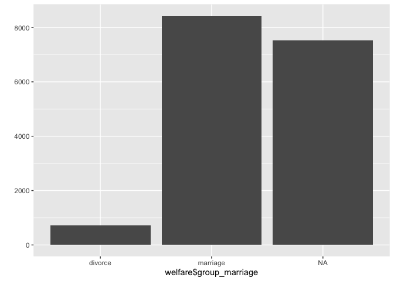

종교 유무에 따른 이혼율
================
오유리
July 30, 2020

## 8\. 종교 유무에 따른 이혼율

### 분석 절차

검토 및 전처리할 변수: 종교, 혼인 상태

### 종교 변수 검토 및 전처리하기

#### 1\. 변수 검토하기

religioni 변수를 검토한다. 변수가 1과 2만 있는걸 확인할 수 있다.

``` r
class(welfare$religion)

table(welfare$religion)
```

#### 2\. 전처리

종교 유무 이름 부여. “있음”이 아닐경우 종교 없음으로 처리한다.

``` r
welfare$religion <- ifelse(welfare$religion == 1, "yes", "no")
table(welfare$religion)

table(is.na(welfare$religion))

qplot(welfare$religion)
```

<!-- -->

### 혼인 상태 변수 검토 및 전처리하기

#### 1\. 변수 검토하기

이혼 변수를 검토한다.

``` r
class(welfare$marriage)

table(welfare$marriage)
```

#### 2\. 전처리

배우자가 있을경우: 1, 이혼 했을경우: 3, 나머지는 해당이 없는 상태: NA로 처리한다.

``` r
welfare$group_marriage <- ifelse(welfare$marriage == 1, "marriage", ifelse(welfare$marriage == 3, "divorce", NA))

table(welfare$group_marriage)

table(is.na(welfare$group_marriage))

qplot(welfare$group_marriage)
```

<!-- -->

### 종교 유무에 따른 이혼율 분석하기

#### 1\. 종교 유무에 따른 이혼율 표 만들기

종교 유무 및 결혼 상태별로 나눠 빈도를 구한 뒤 각 종교 유무 집단의 전체 빈도로 나눠 비율을 구합니다. 비율은 소수점
첫째자리까지 표현되도록 한다.

``` r
religion_marriage <- welfare %>% 
  filter(!is.na(group_marriage)) %>%
  group_by(religion,group_marriage) %>% 
  summarise(n=n()) %>% 
  mutate(tot_group = sum(n)) %>% 
  mutate(pct = round(n/tot_group*100, 1))
  

religion_marriage
```

#### `count()` 활용

``` r
religion_marriage <- welfare %>% 
  filter(!is.na(group_marriage)) %>% 
  count(religion,group_marriage) %>% 
  group_by(religion) %>% 
  mutate(pct = round(n/sum(n)*100,1))

religion_marriage
```

    ## # A tibble: 4 x 4
    ## # Groups:   religion [2]
    ##   religion group_marriage     n   pct
    ##   <chr>    <chr>          <int> <dbl>
    ## 1 no       divorce          384   8.3
    ## 2 no       marriage        4218  91.7
    ## 3 yes      divorce          328   7.2
    ## 4 yes      marriage        4213  92.8

#### 2\. 이혼율 표 만들기

``` r
divorce <- religion_marriage %>% 
  filter(group_marriage == "divorce") %>% 
  select(religion, pct)
divorce
```

    ## # A tibble: 2 x 2
    ## # Groups:   religion [2]
    ##   religion   pct
    ##   <chr>    <dbl>
    ## 1 no         8.3
    ## 2 yes        7.2

#### 3\. 그래프 만들기

종교가 없는경우 1.1% 이혼율이 높다는것을 알 수 있다.

``` r
ggplot(data=divorce, aes(x=religion,y=pct)) + geom_col()
```

<!-- -->

### 연령대 및 종교 유무에 따른 이혼율 분석하기

#### 1\. 연령대별 이혼율 표 만들기

``` r
ageg_marriage <- welfare %>% 
  filter(!is.na(group_marriage)) %>% 
  group_by(ageg,group_marriage) %>% 
  summarise(n=n()) %>% 
  mutate(tot_group = sum(n)) %>% 
  mutate(pct = n/tot_group*100,1)
  

ageg_marriage
```

    ## # A tibble: 6 x 6
    ## # Groups:   ageg [3]
    ##   ageg   group_marriage     n tot_group   pct   `1`
    ##   <chr>  <chr>          <int>     <int> <dbl> <dbl>
    ## 1 middle divorce          437      4918  8.89     1
    ## 2 middle marriage        4481      4918 91.1      1
    ## 3 old    divorce          273      4165  6.55     1
    ## 4 old    marriage        3892      4165 93.4      1
    ## 5 young  divorce            2        60  3.33     1
    ## 6 young  marriage          58        60 96.7      1

#### `count()` 활용

``` r
ageg_marriage <- welfare %>%
  filter(!is.na(group_marriage)) %>% 
  count(ageg,group_marriage) %>% 
  group_by(ageg) %>% 
  mutate(pct = round(n/sum(n)*100,1))

ageg_marriage
```

    ## # A tibble: 6 x 4
    ## # Groups:   ageg [3]
    ##   ageg   group_marriage     n   pct
    ##   <chr>  <chr>          <int> <dbl>
    ## 1 middle divorce          437   8.9
    ## 2 middle marriage        4481  91.1
    ## 3 old    divorce          273   6.6
    ## 4 old    marriage        3892  93.4
    ## 5 young  divorce            2   3.3
    ## 6 young  marriage          58  96.7

#### 2\. 연령대별 이혼율 그래프 만들기

초년은 사례가 부족해 제외한다.

``` r
ageg_divorce <- ageg_marriage %>% 
  filter(ageg != "young",group_marriage == "divorce") %>% 
  select(ageg, pct)

ageg_divorce
```

    ## # A tibble: 2 x 2
    ## # Groups:   ageg [2]
    ##   ageg     pct
    ##   <chr>  <dbl>
    ## 1 middle   8.9
    ## 2 old      6.6

``` r
ggplot(data= ageg_divorce, aes(x= ageg, y=pct)) + geom_col()
```

<!-- -->

#### 3\. 연령대 및 종교 유무에 따른 이혼율 표 만들기

연령대 종교 유무, 결혼 상태별로 집단을 나눠 빈도를 구한뒤, 각 집단 전체 빈도로 나눠 비율을 구한다. 그 다음, 이혼에
해당하는 값만 추출해 연령대 및 종교 유무별 이혼율 표를 만든다.

``` r
ageg_religion_marriage <- welfare %>% 
  filter(!is.na(group_marriage) & ageg != "young") %>%
  group_by(ageg,religion,group_marriage) %>% 
  summarise(n = n()) %>% 
  mutate(tot_group = sum(n)) %>% 
  mutate(pct = round(n/tot_group*100,1))
ageg_religion_marriage
```

    ## # A tibble: 8 x 6
    ## # Groups:   ageg, religion [4]
    ##   ageg   religion group_marriage     n tot_group   pct
    ##   <chr>  <chr>    <chr>          <int>     <int> <dbl>
    ## 1 middle no       divorce          260      2681   9.7
    ## 2 middle no       marriage        2421      2681  90.3
    ## 3 middle yes      divorce          177      2237   7.9
    ## 4 middle yes      marriage        2060      2237  92.1
    ## 5 old    no       divorce          123      1884   6.5
    ## 6 old    no       marriage        1761      1884  93.5
    ## 7 old    yes      divorce          150      2281   6.6
    ## 8 old    yes      marriage        2131      2281  93.4

#### `count()` 활용

``` r
ageg_religion_marriage <- welfare %>% 
  filter(!is.na(group_marriage) & ageg != "young") %>% 
  count(group_marriage,religion,ageg) %>% 
  group_by(ageg,religion) %>% 
  mutate(pct = round(n/sum(n)*100,1))

ageg_religion_marriage
```

    ## # A tibble: 8 x 5
    ## # Groups:   ageg, religion [4]
    ##   group_marriage religion ageg       n   pct
    ##   <chr>          <chr>    <chr>  <int> <dbl>
    ## 1 divorce        no       middle   260   9.7
    ## 2 divorce        no       old      123   6.5
    ## 3 divorce        yes      middle   177   7.9
    ## 4 divorce        yes      old      150   6.6
    ## 5 marriage       no       middle  2421  90.3
    ## 6 marriage       no       old     1761  93.5
    ## 7 marriage       yes      middle  2060  92.1
    ## 8 marriage       yes      old     2131  93.4

#### 연령대 및 종교 유무별 이혼율 표 만들기

``` r
df_divorce <- ageg_religion_marriage %>% 
  filter(group_marriage == "divorce") %>% 
  select(ageg,religion,pct)


df_divorce
```

    ## # A tibble: 4 x 3
    ## # Groups:   ageg, religion [4]
    ##   ageg   religion   pct
    ##   <chr>  <chr>    <dbl>
    ## 1 middle no         9.7
    ## 2 old    no         6.5
    ## 3 middle yes        7.9
    ## 4 old    yes        6.6

#### 4\. 연령대 및 종교 유무에 따른 이혼율 그래프 만들기

이혼혼율표를 이용해 연령대별 종교 유무 그래프를 만든다.

``` r
ggplot(data=df_divorce ,aes(x=ageg,y=pct, fill=religion)) + geom_col(position="dodge")
```

<!-- -->
