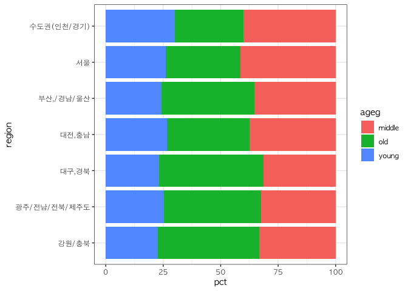
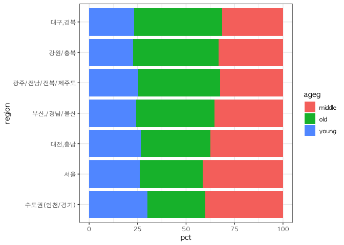
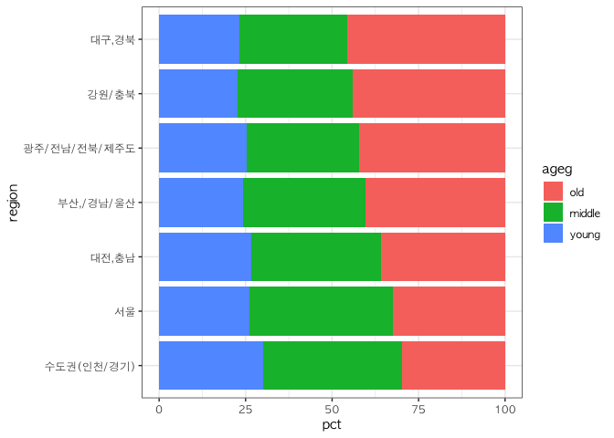

지역별 연령대 비율 - “노년층이 많은 지역은 어디일까?”
================
오유리
July 30, 2020

## 9\. 지역별 연령대 비율

노년이 많은 지역을 알아보겠습니다.

### 분석 절차

검토 및 전처리할 변수: 지역, 연령대

### 지역 변수 검토 및 전처리하기

#### 1\. 변수 검토하기

연령대 변수는 이미 검토 했으니 건너뛴다.

``` r
class(welfare$code_region)


table(welfare$code_region)
```

#### 2\. 전처리

#### `welfare`에 지역명 변수 추가

``` r
list_region <- data.frame(code_region=c(1:7),
                          region = c("서울",
                                     "수도권(인천/경기)",
                                     "부산,/경남/울산",
                                     "대구,경북",
                                     "대전,충남",
                                     "강원/충북",
                                     "광주/전남/전북/제주도"))

list_region
```

    ##   code_region                region
    ## 1           1                  서울
    ## 2           2     수도권(인천/경기)
    ## 3           3       부산,/경남/울산
    ## 4           4             대구,경북
    ## 5           5             대전,충남
    ## 6           6             강원/충북
    ## 7           7 광주/전남/전북/제주도

``` r
# 지역명 변수 추가
welfare <- left_join(welfare, list_region, id="code_region")
```

    ## Joining, by = "code_region"

``` r
## Joining, by ="code_region"

welfare %>% 
  select(code_region,region) %>% 
  head
```

    ##   code_region region
    ## 1           1   서울
    ## 2           1   서울
    ## 3           1   서울
    ## 4           1   서울
    ## 5           1   서울
    ## 6           1   서울

### 지역별 연령대 비율 분석하기

#### 1\. 지역별 연령대 비율표 만들기

``` r
region_ageg <- welfare %>% 
  group_by(region,ageg) %>% 
  summarise(n=n()) %>% 
  mutate(tot_group = sum(n)) %>% 
  mutate(pct = round(n/tot_group*100,2))

head(region_ageg)
```

    ## # A tibble: 6 x 5
    ## # Groups:   region [2]
    ##   region                ageg       n tot_group   pct
    ##   <chr>                 <chr>  <int>     <int> <dbl>
    ## 1 강원/충북             middle   417      1257  33.2
    ## 2 강원/충북             old      555      1257  44.2
    ## 3 강원/충북             young    285      1257  22.7
    ## 4 광주/전남/전북/제주도 middle   947      2922  32.4
    ## 5 광주/전남/전북/제주도 old     1233      2922  42.2
    ## 6 광주/전남/전북/제주도 young    742      2922  25.4

#### `count()` 활용

``` r
region_ageg <- welfare %>% 
  count(region,ageg) %>% 
  group_by(region) %>% 
  mutate(pct = round(n/sum(n)*100,2))

head(region_ageg)
```

    ## # A tibble: 6 x 4
    ## # Groups:   region [2]
    ##   region                ageg       n   pct
    ##   <chr>                 <chr>  <int> <dbl>
    ## 1 강원/충북             middle   417  33.2
    ## 2 강원/충북             old      555  44.2
    ## 3 강원/충북             young    285  22.7
    ## 4 광주/전남/전북/제주도 middle   947  32.4
    ## 5 광주/전남/전북/제주도 old     1233  42.2
    ## 6 광주/전남/전북/제주도 young    742  25.4

#### 2\. 그래프 만들기

연령대 비율 막대를 서로 다른색으로 표현한다. 비교하기 쉽도록 그래프를 오른쪽으로 회전한다.

``` r
theme_set(theme_bw(base_family = "AppleGothic"))
ggplot(data= region_ageg, aes(x=region, y=pct, fill=ageg)) + geom_col() + coord_flip()
```

<!-- -->

#### 3\. 막대 정렬하기 : 노년층 비율 높은 순

막대를 노년층 비율이 높은 순으로 정렬한다. 먼저 노년층 비율 순으로 지역명이 정렬된 변수를 만든다. 앞에서 만든 표를 노년층
비율 순으로 정렬한 후 지역명만 추출해 변수를 만든다.

``` r
# 노년층 비율 내림차순 정렬

list_order_old <- region_ageg %>% 
  filter(ageg == "old") %>% 
  arrange(pct)

list_order_old
```

    ## # A tibble: 7 x 4
    ## # Groups:   region [7]
    ##   region                ageg      n   pct
    ##   <chr>                 <chr> <int> <dbl>
    ## 1 수도권(인천/경기)     old    1109  29.9
    ## 2 서울                  old     805  32.4
    ## 3 대전,충남             old     527  35.9
    ## 4 부산,/경남/울산       old    1124  40.4
    ## 5 광주/전남/전북/제주도 old    1233  42.2
    ## 6 강원/충북             old     555  44.2
    ## 7 대구,경북             old     928  45.6

``` r
# 지역명 순서 변수 만들기

order <- list_order_old$region

ggplot(data = region_ageg, aes(x=region, y = pct,fill=ageg)) + geom_col() + coord_flip() + scale_x_discrete(limits = order)
```

<!-- -->

#### 4\. 연령대 순으로 막대 색깔 나열하기

그래프를 초년, 중년, 노년 순으로 설정한다. fill 파라미터에 지정할 변수의 범주 순서를 지정하면 된다. 현재 ageg변수는
character 타입이기 떄문에 levels가 없다.

``` r
class(region_ageg$ageg)

levels(region_ageg$ageg)
```

factor를 이용해 ageg을 factor 타입으로 변환하고, level파라미터를 이용해 순서를 지정한다.

``` r
region_ageg$ageg <-factor(region_ageg$ageg, level = c("old","middle","young"))

class(region_ageg$ageg)

levels(region_ageg$ageg)

ggplot(data=region_ageg, aes(x=region, y=pct, fill=ageg)) + geom_col() + coord_flip() + scale_x_discrete(limits = order)
```

<!-- -->
