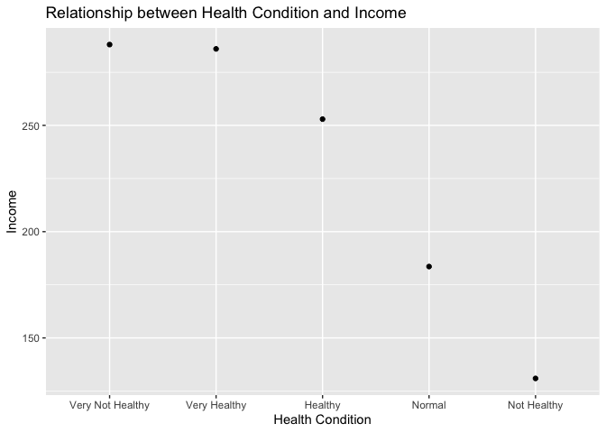

건강상태에 따른 소득차이
================
오유리
02/08/2020

### 분석 절차

### 연령대 변수 검토 및 전처리하기

``` r
library(foreign)             # SPSS 파일 로드
library(dplyr)               # 전처리
```

    ## 
    ## Attaching package: 'dplyr'

    ## The following objects are masked from 'package:stats':
    ## 
    ##     filter, lag

    ## The following objects are masked from 'package:base':
    ## 
    ##     intersect, setdiff, setequal, union

``` r
library(ggplot2)             # 시각화
library(readxl)              # 엑셀 파일 불러오기

# 데이터 불러오기
raw_welfare <- read.spss(file = "Koweps_hpc10_2015_beta1.sav",
                         to.data.frame = T)
```

    ## Warning in read.spss(file = "Koweps_hpc10_2015_beta1.sav", to.data.frame = T):
    ## Koweps_hpc10_2015_beta1.sav: Compression bias (0) is not the usual value of 100

``` r
# 복사본 만들기
welfare <- raw_welfare

# 엑셀로 옮겨서 변수 확인
# write.csv(welfare,"welfare.csv")

# 변수 이름 변경하기기
welfare <- rename(welfare,
                  income = p1002_8aq1,     # 월급
                  med_cond = h10_med2)     #건강상태 ( "1.아주 건강하다             2.건강한 편이다 3.보통이다 4.건강하지 않은 편이다 5.건강이 아주 안 좋다")
```

#### 1\. 결측치 처리하기

``` r
# 월급 결측치 처리
welfare$income <- ifelse(welfare$income %in% c(0,9999), NA, welfare$income)

# 건강상태 결측치 처리

class(welfare$med_cond)
```

    ## [1] "numeric"

#### 2.건강상태별 월급표 만들기.

``` r
# 건강상태 변수 타입을 레벨로 바꾼다.
welfare$med_cond <- as.factor(welfare$med_cond)
class(welfare$med_cond)
```

    ## [1] "factor"

``` r
levels(welfare$med_cond)
```

    ## [1] "1" "2" "3" "4" "5"

``` r
#월급표를 만든다 

med_income <- welfare %>% 
  filter(!is.na(income) & !is.na(med_cond)) %>% 
  group_by(med_cond) %>% 
  summarise(mean_income = mean(income))

med_income
```

    ## # A tibble: 5 x 2
    ##   med_cond mean_income
    ##   <fct>          <dbl>
    ## 1 1               286.
    ## 2 2               253.
    ## 3 3               184.
    ## 4 4               131.
    ## 5 5               288.

#### 3.소득과 건강상태 그래프

``` r
# 1~5변수로 된 건강상태를 알아보기 쉽게 바꾼다.

med_income <- med_income %>% 
  mutate(healthy = ifelse(med_cond == "1", "Very Healthy", ifelse(med_cond == "2",  "Healthy", ifelse(med_cond == "3", "Normal", ifelse(med_cond == "4", "Not Healthy", ifelse(med_cond == "5", "Very Not Healthy", NA))))))

med_income

# 소득이 많은 순으로 그래프를 그린다.

ggplot(med_income,aes(reorder(healthy,-mean_income),mean_income))+geom_point()  + labs(x="Health Condition",y="Income", title= "Relationship between Health Condition and Income") 
```

<!-- -->

가장 건강이 안좋은 사람들의 소득 평균이 가장 높다. 하지만 가장 건강한 사람들은 근소한 차이로 평균 소득이 그 다음으로 높다.
소득과 건강상태는 비례하지만, 적절한 선의 소득에 만족하는 사람들이 건강을 잘 챙길 수 있다고 해석될 수도 있겠다.
