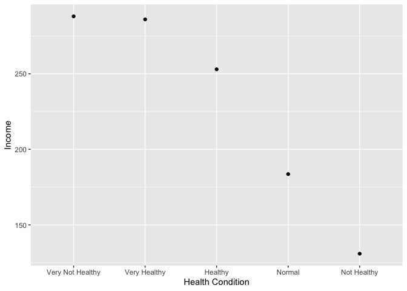
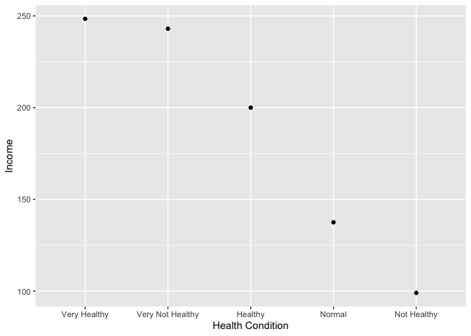

건강상태와 소득의 관계
================
오유리
02/08/2020

건강한 사람들은 소득이 많은지 알기 위해 건강상태별 평균 월급의 관계를 알아보려고 한다. 데이터는 10차 한국복지패널데이터를
사용했다.

### 분석 절차

### 연령대 변수 검토 및 전처리하기

#### 1\. 월급 변수 및 결측치 확인

월급이 0\~9999 사이가 아니면 결측치를 NA로 처리한다.

``` r
class(welfare$income)
table(welfare$income)
welfare$income <- ifelse(welfare$income %in% c(0,9999), NA, welfare$income)
```

#### 2\. 건강상태 변수 및 결측치 확인

건강상태 데이터는 결측치는 없지만 변수를 범주형태로 바꿔야 하는것을 알 수 있다.

``` r
class(welfare$med_cond)
table(welfare$med_cond)
```

건강상태 데이터를 범주형으로 바꾼다.

``` r
welfare$med_cond <- as.factor(welfare$med_cond)
class(welfare$med_cond)
levels(welfare$med_cond)
```

### 월급표

#### 1\. 건강상태별 평균 월급표를 만든다.

``` r
med_income <- welfare %>% 
  filter(!is.na(income) & !is.na(med_cond)) %>% 
  group_by(med_cond) %>% 
  summarise(mean_income = mean(income))

med_income
```

    ## # A tibble: 5 x 2
    ##   med_cond mean_income
    ##   <fct>          <dbl>
    ## 1 1               286.
    ## 2 2               253.
    ## 3 3               184.
    ## 4 4               131.
    ## 5 5               288.

### 소득과 건강상태 그래프

#### 1\. 1\~5변수로 된 건강상태를 알아보기 쉽게 바꾼다.

1이 가장 건강하고, 5가 가장 건강하지 않다는것을 의미하므로, 해당 데이터를 알기 쉽게 바꾼 health 라는 새로운 행을
추가한다.

``` r
med_income <- med_income %>% 
  mutate(health = ifelse(med_cond == "1", "Very Healthy", ifelse(med_cond == "2",  "Healthy", ifelse(med_cond == "3", "Normal", ifelse(med_cond == "4", "Not Healthy", ifelse(med_cond == "5", "Very Not Healthy", NA))))))

med_income
```

    ## # A tibble: 5 x 3
    ##   med_cond mean_income health          
    ##   <fct>          <dbl> <chr>           
    ## 1 1               286. Very Healthy    
    ## 2 2               253. Healthy         
    ## 3 3               184. Normal          
    ## 4 4               131. Not Healthy     
    ## 5 5               288. Very Not Healthy

#### 2\. 소득이 많은 순으로 그래프를 그린다

알기쉽게 바꾼 건강상태 데이터와 월급 데이터를 가지고 그래프를 그린다. 비교하기 쉽도록 월급이 높은순으로 순서를 정렬했다. 근소한
차이를 보이는 데이터가 있어 막대 그래프보다는 점 그래프를 그렸다.

``` r
ggplot(med_income,aes(reorder(health,-mean_income),mean_income)) + geom_point()  + labs(x="Health Condition",y="Income") 
```

<!-- -->

가장 건강이 안좋은 사람들의 소득 평균이 가장 높다. 하지만 가장 건강한 사람들은 근소한 차이로 평균 소득이 그 다음으로 높다.
소득과 건강상태는 비례하지만, 적절한 선의 소득에 만족하는 사람들이 건강을 잘 챙길 수 있다고 해석될 수도 있겠다.

### median을 사용해 인구밀도를 고려한 월급 평균을 사용해본다.

#### 1\. 같은 방식이지만 median을 사용해 월급표를 만든다.

median으로 평균을 구해보면 소수의 아주 크거나 작은 월급으로 인해 평균의 차이가 생겼는지를 알아볼 수 있다.

``` r
med_mincome <- welfare %>% 
  filter(!is.na(income) & !is.na(med_cond)) %>% 
  group_by(med_cond) %>% 
  summarise(mean_income = median(income))

med_mincome <- med_mincome %>% 
  mutate(health2 = ifelse(med_cond == "1", "Very Healthy", ifelse(med_cond == "2",  "Healthy", ifelse(med_cond == "3", "Normal", ifelse(med_cond == "4", "Not Healthy", ifelse(med_cond == "5", "Very Not Healthy", NA))))))
med_mincome
```

    ## # A tibble: 5 x 3
    ##   med_cond mean_income health2         
    ##   <fct>          <dbl> <chr>           
    ## 1 1               248. Very Healthy    
    ## 2 2               200  Healthy         
    ## 3 3               138. Normal          
    ## 4 4                99  Not Healthy     
    ## 5 5               243  Very Not Healthy

#### 2\. 같은 방식으로 그래프를 그린다.

``` r
ggplot(med_mincome,aes(reorder(health2,-mean_income),mean_income)) + geom_point()  + labs(x="Health Condition",y="Income") 
```

<!-- -->

이번에는 가장 건강한 사람들이 가장 월급이 많다고 나오고, 그 다음이 가장 건강하지 않다고 나오고, 나머지는 건강상태가 똑같이
월급과 비례한다. 추가 정보로 대체적으로 평균월급이 줄어들어 낮은 연봉의 사람들이 전반적으로 더 많다는것을 알 수 있다.
본론으로 돌아가서, 가장 건강하지 않다고 나온 데이터의 월급 평균이 가장 건강한사람들에게 제쳐질 정도로 더 많이 줄어들었음을
통해 상대적으로 적은 숫자의 높은 월급의 사람들이 건강상태가 가장 안좋았던 그룹에 속해있어 이런 결과가 생겼다고 볼 수 있다.

### 결론: 소득과 건강은 대체로 비례하지만 월급이 많이 높은 경우에는 오히려 가장 건강이 않좋은 사람들이 많다고 추측된다.
